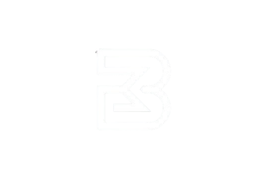

 

 

  

---

## About

<table>
<tr>
<td width="58%" valign="middle">

  

I build and check machine learning systems: language models, computer vision, and data work that has to hold up in practice.

  

  

</td>
<td width="42%" valign="middle" align="center">

</td>
</tr>
</table>

---

### Tools I reach for

 

 

**Models**

**Quality**

**Data**

---

### GitHub

 

  

  

  

---

### Contribution snake

The grid below is generated every day by [this workflow](https://github.com/BishoyMK/BishoyMK/actions/workflows/snake.yml).

<picture>
  <source media="(prefers-color-scheme: dark)" srcset="https://raw.githubusercontent.com/BishoyMK/BishoyMK/output/github-contribution-grid-snake-dark.svg" />
  <source media="(prefers-color-scheme: light)" srcset="https://raw.githubusercontent.com/BishoyMK/BishoyMK/output/github-contribution-grid-snake.svg" />
  
</picture>

---

### Say hello

 

